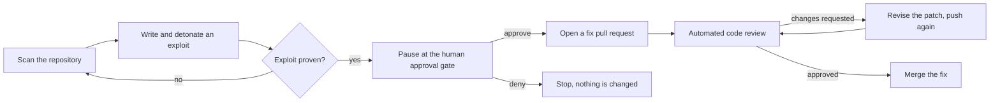
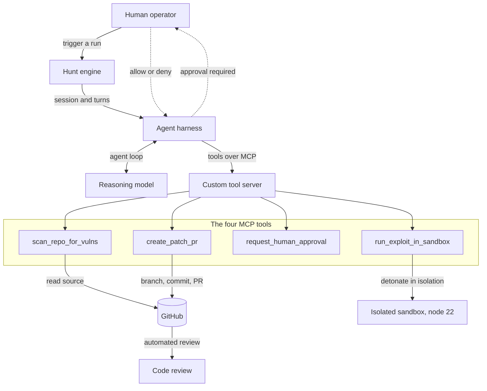
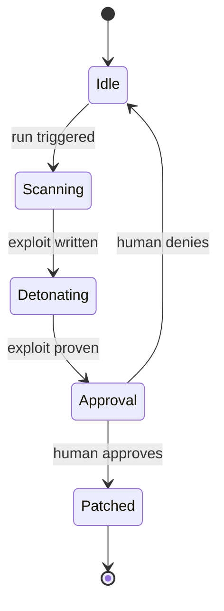

<div align="center">

# 🛡️ TARTARUS

### Autonomous Red-Team and SecOps Agent

**An AI agent that finds a vulnerability, proves it with a real exploit in an isolated sandbox, waits for human approval, then opens the fix as a pull request.**


</div>

## About this project

Tartarus is a full-stack TypeScript project exploring a hard question: can an autonomous agent be trusted to touch a real codebase? Most AI security tools either flood you with unproven findings or act without a human in the loop. Tartarus is built around two invariants that address both. It does not report a vulnerability until an exploit actually triggers it in a sandbox, so every finding is backed by evidence. And it cannot open a pull request until a human approves, because the approval is enforced by the agent runtime, not merely requested in a prompt.

The result is a working codebase with an agent backend, four custom tools exposed over the Model Context Protocol, an isolated sandbox execution layer, a self-healing review loop, and a polished real-time dashboard.

## How a run flows



## Highlights

- **Runtime-enforced human approval.** The one tool that writes to your repository is gated by the agent harness, which suspends the run until a human approves. Safe autonomy by construction, not by prompt.
- **Evidence-based findings.** Exploits detonate in an isolated, ephemeral sandbox and must print a success sentinel before a bug is reported. No triage backlog of maybe-vulnerabilities.
- **Self-healing loop.** When the code reviewer requests changes, the agent reads the comments, regenerates the patch, and pushes a new commit to the same pull request.
- **Real-time dashboard.** A spatial, glassmorphism React interface streams the agent's progress over Server-Sent Events, with a live isometric visualization of the sandbox, an animated stepper, and a GitHub-style approval diff with token-level highlighting.
- **Production-minded engineering.** 74 unit tests with zero runtime dependencies, a CI pipeline running type-checks, tests, CodeQL, and Trivy, structured error handling, and a pre-flight health check.

## Tech stack

| Layer | Technology |
|-------|-----------|
| Language | TypeScript (strict), Node.js 22 |
| Agent harness | TrueForge |
| Reasoning model | Claude, provider-neutral through the harness |
| Tooling protocol | Model Context Protocol, Streamable HTTP |
| Sandbox execution | Daytona, isolated and ephemeral |
| Code review | Qodo agentic PR review |
| Source control API | GitHub via Octokit |
| Frontend | React 18, Vite, Tailwind CSS, Framer Motion |
| Realtime transport | Server-Sent Events over Express |
| Testing | Node native test runner |
| CI | GitHub Actions, CodeQL, Trivy |

## Architecture



The reasoning model decides what looks vulnerable and how to fix it. The harness enforces the guarantees: it streams the agent loop, dispatches the four tools, and physically pauses before the one tool that changes the outside world.

## The sandbox lifecycle

The dashboard renders the sandbox as a live isometric visualization that follows this exact state machine.



## The engineering detail I am most proud of

The single most important line in the agent configuration:

```jsonc
"mcp_servers": [{
  "name": "tartarus-tools",
  "require_approval_for_tools": ["create_patch_pr"]
}]
```

This tells the runtime to pause before executing a named tool. When the model decides to open a pull request, the harness does not run it. It emits an approval-required event and suspends the turn until a human resolves it. The model is structurally incapable of writing to the repository on its own. The prompt makes the agent well informed; the runtime makes the decision unavoidable. That separation is the whole design.

## What makes it more than a scanner

| Capability | A typical scanner | Tartarus |
|------------|:---:|:---:|
| Proves the bug with a live exploit | ❌ | ✅ |
| Human approval enforced by the runtime | ❌ | ✅ |
| Writes the fix as a pull request | ❌ | ✅ |
| Revises its patch from review feedback | ❌ | ✅ |
| Detonation isolated from your host | ❌ | ✅ |
| Evidence, not a triage backlog | ❌ | ✅ |

## Running it locally

```bash
npm install
cp .env.example .env      # add your model, GitHub, and sandbox keys (see docs/ENV_GUIDE.md)
npm run build
npm test                  # 74 tests, Node native runner, zero dependencies

npx @truefoundry/trueforge@latest         # start the agent harness, add the model and sandbox in its UI
npm run mcp                                # start the custom tool server
npm run register                           # register the tools with the harness
npm run doctor                             # pre-flight: verify every service is reachable
npm run hunt:ui -- your-org/some-repo      # run against a target, with the dashboard
```

Full setup with local networking notes is in [SETUP.md](SETUP.md), the environment reference is in [docs/ENV_GUIDE.md](docs/ENV_GUIDE.md), and a longer engineering write-up is in [docs/BLOG_POST.md](docs/BLOG_POST.md).

The [ui/](ui/) folder is a standalone Vite app. Run it on its own with `npm --prefix ui run dev` to explore the interface.

## Project structure

| Path | Role |
|------|------|
| [src/mcp/server.ts](src/mcp/server.ts) | MCP server, Streamable HTTP with bearer auth, hosting the four tools. |
| [src/mcp/tools/](src/mcp/tools/) | The four tools: scan, detonate, approve, patch. |
| [src/services/sandbox.ts](src/services/sandbox.ts) | Isolated exploit detonation, always torn down. |
| [src/agent/hunt.ts](src/agent/hunt.ts) | The reusable run engine that drives the agent loop. |
| [src/agent/selfHeal.ts](src/agent/selfHeal.ts) | The self-healing loop that responds to review feedback. |
| [src/server/hub.ts](src/server/hub.ts) | Realtime backend: SSE stream, approvals, and a webhook. |
| [ui/](ui/) | The dashboard and landing page, React with Tailwind and Framer Motion. |
| [test/](test/) | The unit test suite. |
| [examples/Tartarus-Patient-Zero/](examples/Tartarus-Patient-Zero/) | An intentionally vulnerable app used as a safe test target. |

## Honest scope

This is a personal engineering project. The codebase, tests, CI, and interface are complete and run locally. The four attack classes in the test target, SQL injection, command injection, path traversal, and SSRF, are real and reproducible. Running the full autonomous loop requires your own model, GitHub, and sandbox credentials, which are read from a git-ignored `.env` and never committed.

## What I learned

Building this clarified where trust in an autonomous system actually comes from. The intelligence of the model matters, but the properties you most need to rely on, such as isolation and human approval, are properties of the runtime the model runs inside, not of the model itself. Designing for that separation, and building an interface that makes the agent's state and the moment it pauses legible to a human, was the core of the work.

<div align="center">

**MIT licensed** · Built with TypeScript, React, and the Model Context Protocol

</div>
