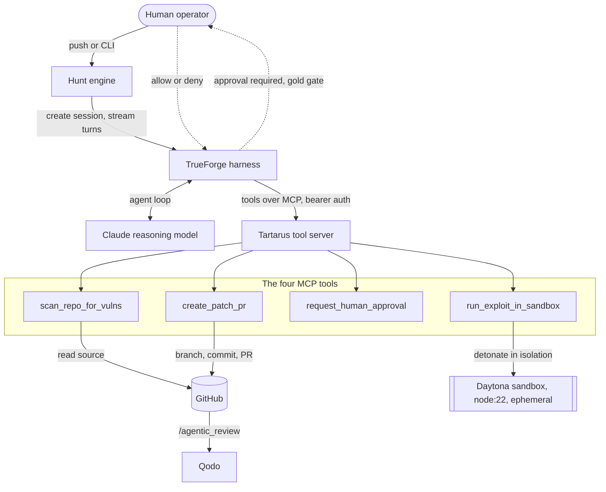

<div align="center">

# 🛡️ TARTARUS

### Autonomous Red-Team and SecOps Agent

**It finds the bug, proves it with a real exploit, waits for your approval, then fixes it.**

Tartarus scans a GitHub repository for vulnerabilities, writes an exploit and detonates it inside an isolated sandbox to prove the bug is real, pauses for a human to approve, then opens a remediation pull request. When the reviewer asks for changes, it revises its own patch and pushes again.

Built on **[TrueForge](https://github.com/truefoundry/trueforge)** · reasoning by **Claude** · tools over **MCP** · sandboxed by **Daytona** · reviewed by **Qodo**


### [🚀 Live demo](https://YOUR-APP.fly.dev) · [🎬 Demo video](https://youtu.be/YOUR_VIDEO)

_Built for The Agent Harness Hackathon (TrueFoundry and Qodo)._

</div>

<p align="center"></p>

---

## The problem

Two things are broken in AI security tooling today. Scanners produce long lists of possible vulnerabilities that a human then has to triage, so the signal-to-noise ratio is poor. And autonomous agents will write to your repository without asking, which is unacceptable for security work.

Tartarus is built around two invariants that answer both. It does not report a vulnerability until an exploit actually triggers it in a sandbox, so every finding is backed by evidence. And it cannot open a pull request until a human approves, because the approval is enforced by the harness runtime rather than requested in a prompt.

## The three capabilities that make it a product

**🛰 Sentinel Mode: zero-click continuous hunting.** Connect Tartarus to a GitHub webhook. The moment a developer pushes vulnerable code, the agent wakes up on its own, scans, detonates, and streams to the dashboard for approval. A real DevSecOps pipeline: push, prove, approve, patch, hands-free. See [src/server/sentinel.ts](src/server/sentinel.ts).

**🔁 Self-Healing Loop: agentic collaboration with Qodo.** If Qodo reviews the fix and requests changes, Tartarus reads the comments, regenerates a better patch, and pushes a new commit to the same pull request. Two agents converging on a correct fix, no human in the middle. See [src/agent/selfHeal.ts](src/agent/selfHeal.ts).

**🖥 The Command Center: an enterprise dashboard.** A spatial, glassmorphism console that shows exactly what the agent is doing, why it paused, and the blast radius of the change. It streams live sandbox telemetry during detonation and renders the approval as a GitHub-style side-by-side diff with token-level highlighting. See [ui/](ui/).

<p align="center">
  
  
</p>

## How a hunt flows

```mermaid
sequenceDiagram
    participant Dev as Developer
    participant TF as TrueForge (Claude)
    participant Box as Daytona sandbox
    participant You as Human
    participant Qodo as Qodo
    Dev->>TF: push vulnerable code (or CLI)
    TF->>TF: scan repository, flag sinks
    TF->>Box: write exploit, detonate
    Box-->>TF: TARTARUS_EXPLOIT_OK (proof)
    TF-->>You: pause at the gold gate (approval required)
    You-->>TF: approve
    TF->>Qodo: open remediation PR, request /agentic_review
    Qodo-->>TF: changes requested
    TF->>Qodo: read feedback, push an improved patch
```

## Architecture



## Why the gold gate is the important part

The single most important line in our agent configuration is this one, in [src/agent/spec.ts](src/agent/spec.ts):

```jsonc
"mcp_servers": [{
  "name": "tartarus-tools",
  "require_approval_for_tools": ["create_patch_pr"]
}]
```

`require_approval_for_tools` tells the TrueForge runtime to pause before it runs a named tool. When the model decides to call `create_patch_pr`, the harness does not execute it. It emits a `tool.approval_required` event and suspends the turn until a human resolves it. The model is structurally incapable of writing to your repository on its own. The prompt makes the agent well informed, and the harness makes the decision unavoidable.

<p align="center"></p>

## Not another scanner

| Capability | Traditional scanners | Tartarus |
|------------|:---:|:---:|
| Proves the bug in a sandbox | ❌ | ✅ |
| Human approval enforced by the runtime | ❌ | ✅ |
| Writes the fix as a pull request | ❌ | ✅ |
| Self-heals from reviewer feedback | ❌ | ✅ |
| Detonation isolated from your host | ❌ | ✅ |
| Zero-click on push via webhook | ❌ | ✅ |
| Open, inspectable agent loop | ❌ | ✅ |
| Evidence, not a triage backlog | ❌ | ✅ |

## Proof: Qodo agentic review

Every pull request Tartarus opens ends with a `/agentic_review` trigger, so Qodo validates the fix. Our own development followed the same loop: we opened a PR, ran `/agentic_review`, and acted on Qodo's feedback before merging.

<p align="center"></p>

## One-command God Mode

```bash
npm install && cp .env.example .env      # fill in keys, see docs/ENV_GUIDE.md
npm run ui:build                          # build the dashboard once
npm run register                          # register the MCP tools with TrueForge (once)

npm run start:godmode                     # MCP tools + Sentinel (dashboard on :8799) + tunnel
npm run webhook:register                  # auto-registers the GitHub push webhook
```

Open the dashboard, push vulnerable code to your target repo, and watch the agent scan, detonate, pause at the gold gate, and open a fix. Full setup, including the `localhost` versus `host.docker.internal` case, is in [SETUP.md](SETUP.md). The key guide is in [docs/ENV_GUIDE.md](docs/ENV_GUIDE.md), the demo script in [docs/DEMO_SCRIPT.md](docs/DEMO_SCRIPT.md), and the engineering deep dive in [docs/BLOG_POST.md](docs/BLOG_POST.md).

## Running it manually

```bash
npx @truefoundry/trueforge@latest         # harness on :8790, add the model and Daytona in its UI
npm run mcp                                # Tartarus tool server on :8123
npm run register                           # register the tools with TrueForge
npm run doctor                             # pre-flight: verify all four services are ready
npm run hunt:ui -- your-org/Tartarus-Patient-Zero   # hunt with the dashboard
npm test                                   # 74 tests, Node's native runner, zero dependencies
```

## Project layout

| Path | Role |
|------|------|
| [src/mcp/server.ts](src/mcp/server.ts) | MCP server (Streamable HTTP, bearer auth) hosting the four tools. |
| [src/mcp/tools/](src/mcp/tools/) | The four tools: scan, detonate, approve, patch. |
| [src/services/sandbox.ts](src/services/sandbox.ts) | Isolated exploit detonation on Daytona, always torn down. |
| [src/agent/hunt.ts](src/agent/hunt.ts) | The reusable hunt engine that both the CLI and Sentinel drive. |
| [src/agent/selfHeal.ts](src/agent/selfHeal.ts) | The self-healing loop that responds to Qodo reviews. |
| [src/server/hub.ts](src/server/hub.ts) | Command Center backend: SSE stream, approvals, and the webhook. |
| [ui/](ui/) | The dashboard and landing page (React, Tailwind, Framer Motion). |
| [examples/Tartarus-Patient-Zero/](examples/Tartarus-Patient-Zero/) | The intentionally vulnerable target. |

## Security posture

Exploit code never touches the host. It runs in an ephemeral, network-isolated Daytona sandbox that is destroyed in a `finally` block. Credentials stay in the harness, so the sandbox only ever sees the target and exploit code. The one tool that changes the outside world is gated by a human decision the runtime enforces. The tool server is authenticated with a shared bearer token, and every tool returns structured, retryable errors rather than crashing. Our own CI runs CodeQL static analysis and a Trivy vulnerability scan on every pull request.

<div align="center">

Claude for the intelligence, TrueForge for the trust. Both matter, and the second one is the part the industry keeps underinvesting in.

**MIT licensed** · Built for The Agent Harness Hackathon

</div>
