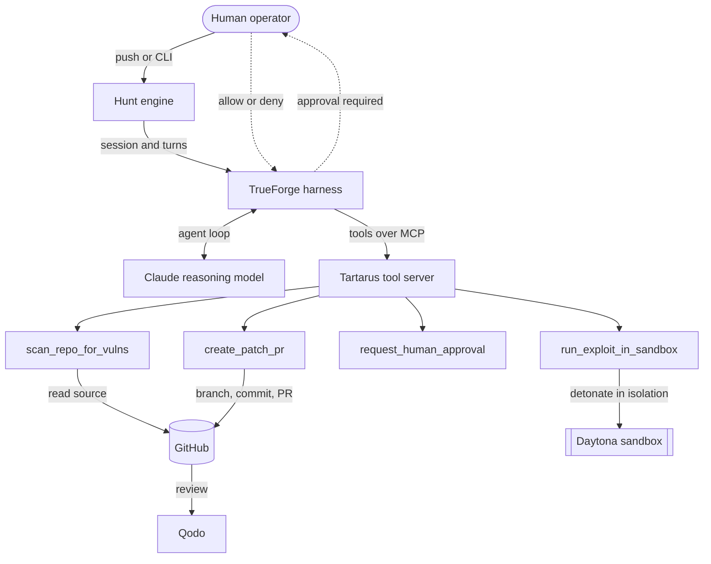

# Building an autonomous red-team agent that a human can actually trust

Most demonstrations of "autonomous security agents" fall apart on two questions. Can it prove that a bug is real, and can you stop it before it does something you did not authorize? We built Tartarus to answer both with a firm yes. This is an engineering account of how it works, the constraints that shaped it, and the specific platform features we leaned on to keep an autonomous agent inside a boundary a human controls.

Tartarus scans a GitHub repository for vulnerabilities, writes an exploit, detonates that exploit inside an isolated sandbox to prove the bug is triggerable, pauses for a human to approve the fix, and then opens a pull request. When a reviewer requests changes, it reads the feedback, revises its own patch, and pushes a new commit. The whole thing runs on TrueForge, an open-source agent harness, with Claude as the reasoning model, Daytona as the sandbox, and Qodo as the code reviewer.

## The two hard constraints

Before writing any code we wrote down the two properties the system had to guarantee, because everything else follows from them.

The first constraint is evidence. A scanner that emits a list of "possible" vulnerabilities is a triage burden, not a solution. Security engineers already drown in findings that turn out to be false positives. We decided that Tartarus would not report a vulnerability until it could trigger the vulnerability in a running sandbox. A finding is either proven or it does not exist as far as the agent is concerned.

The second constraint is authority. An autonomous agent that can write to your repository without asking is a liability, no matter how good its judgment usually is. The interesting question is not whether the agent is well behaved on average. It is whether the system can make it structurally impossible for the agent to take an irreversible action without a human decision. Note the word structurally. A polite instruction in a prompt that says "always ask before opening a PR" is not a guarantee. It is a suggestion that the model follows most of the time.

These two constraints, evidence and authority, are the spine of the design.

## The shape of the system

Tartarus is built from four tools, exposed to the harness over the Model Context Protocol, plus the orchestration that sequences them.



The harness runs the agent loop. It streams tokens from the model, dispatches tool calls, feeds results back, and repeats until the model decides the work is done. We did not write that loop. Writing it yourself is a rite of passage, and it is also a maintenance burden that adds no value once a good harness exists. What we wrote is the four tools and the policy that governs them.

## Why the harness matters more than the model

Here is the claim that took us a while to internalize. For this class of problem, the harness is doing more of the important work than the model.

The model is responsible for reasoning: which file looks vulnerable, what an exploit for it would look like, how to fix it. That is genuinely hard and Claude is very good at it. But the properties we care about, evidence and authority, are not properties of the model. They are properties of the environment the model runs inside. The model cannot grant itself the right to skip the sandbox. It cannot decide on its own to open a pull request without approval. Those decisions are made by the harness, and that is exactly where they belong.

This is the argument for an open agent harness in one sentence. The behavior you most need to trust is the behavior you most need to be able to inspect, and you cannot inspect a loop you cannot see.

## The approval gate, enforced by the runtime

The single most important line in our agent configuration is this one.

```jsonc
{
  "mcp_servers": [
    {
      "name": "tartarus-tools",
      "enable_tools": ["@all"],
      "require_approval_for_tools": ["create_patch_pr"]
    }
  ]
}
```

`require_approval_for_tools` is a TrueForge feature that tells the harness to pause before it executes a named tool. When the model decides to call `create_patch_pr`, the harness does not run it. Instead it emits a `tool.approval_required` event and suspends the turn. The tool call sits in a pending state until a human resolves it. If the human denies it, the call never runs.

This is the difference between a request and a guarantee. In the prompt we do ask the model to seek approval, and the model does. But the prompt is not what stops an unapproved pull request. The harness is. Even if the model were confused, adversarially prompted, or simply wrong, it cannot reach GitHub through that tool without a human clicking approve. The authority constraint is satisfied by the runtime, not by the model's good behavior.

Our orchestration code consumes the pause and resolves it.

```typescript
for await (const { data: event } of stream.withMetadata()) {
  if (event.type === "tool.approval_required") {
    pendingApprovals.push(event);
  }
}

// Later, once a human has decided:
const decision = await requestApproval(ref.id, call.toolInfo.name, call.function.arguments);
await client.sessions.createTurnStream(session.id, {
  input: [{
    type: "user.tool_approval",
    threadId: pause.threadId,
    toolCallId: ref.id,
    approval: { status: decision ? "allow" : "deny" },
  }],
});
```

In the command line the decision is a terminal prompt. In the web dashboard it is a modal that shows the proposed diff, a confidence signal, and the blast radius before the operator commits. The mechanism underneath is identical. The harness will not proceed until `user.tool_approval` arrives.

## Proving the bug: the sandbox execution model

The evidence constraint is where the sandbox comes in. Tartarus never runs exploit code on the host that runs the agent. Exploit code is, by definition, code designed to do something it should not be able to do. Running it next to your credentials and your orchestration logic would be reckless.

TrueForge treats the sandbox as a tool rather than as the place the agent lives. The agent loop and every credential stay on the server. Only the untrusted work, which is running the exploit against the vulnerable code, is shipped into a throwaway sandbox. We use Daytona as the provider. Each detonation gets a fresh sandbox, and the sandbox is destroyed in a `finally` block whether the exploit succeeds, fails, or hangs.

```typescript
const sandbox = await withTimeout(
  "daytona sandbox start",
  SANDBOX_START_TIMEOUT_MS,
  this.daytona.create({ image: this.nodeImage, language: args.language }),
);
try {
  await sandbox.fs.uploadFile(Buffer.from(args.targetCode), args.targetFilename);
  await sandbox.fs.uploadFile(Buffer.from(args.exploitCode), file);
  const res = await sandbox.process.executeCommand(run(file), undefined, undefined, args.timeoutSec);
  return {
    exitCode: res.exitCode ?? 0,
    stdout: res.result ?? "",
    exploited: (res.result ?? "").includes("TARTARUS_EXPLOIT_OK"),
  };
} finally {
  await this.daytona.delete(sandbox).catch(() => {});
}
```

Two details in that code carry a lot of weight.

First, success is judged by observed behavior, not by an exit code. The exploit script has a contract: print the sentinel `TARTARUS_EXPLOIT_OK` to standard output only when the compromise genuinely happened. A program that merely crashes returns a nonzero exit code, and we do not want a crash to be mistaken for a successful exploit. Tying success to a sentinel the exploit only prints on real compromise keeps the evidence honest.

Second, the sandbox image is pinned to Node 22. Our demonstration target uses the built-in `node:sqlite` module, which only exists on Node 22 and later. Pinning the image avoids a class of failure where the exploit crashes in the sandbox for an environmental reason that has nothing to do with the vulnerability. We also run TypeScript exploits through Node's built-in type stripping rather than fetching a transpiler, so a detonation does not depend on the sandbox having network access to a package registry.

The result is a detonation step that either produces the sentinel, in which case the bug is real, or does not, in which case Tartarus refuses to proceed. There is no middle state where the agent reports a maybe.

## The self-healing loop: two agents converging

The last piece is the part that surprised us with how well it works. After Tartarus opens a pull request, Qodo reviews it. If Qodo requests changes, most systems would stop there and hand the problem back to a human. Tartarus does not stop.

When a review comes back with changes requested, Tartarus reads the review body and the inline comments, gives them back to the model as feedback, generates a revised patch, and commits the revision to the same pull request branch. Then Qodo reviews again. Two independent agents, one that writes and one that critiques, converge on a fix without a human in the middle of the loop.

The decision logic is small and worth showing, because it is the kind of thing that is easy to get subtly wrong.

```typescript
export function needsChanges(reviews: Review[]): boolean {
  const decisive = reviews
    .filter((r) => r.state === "CHANGES_REQUESTED" || r.state === "APPROVED")
    .sort((a, b) => a.submittedAt.localeCompare(b.submittedAt));
  return decisive.at(-1)?.state === "CHANGES_REQUESTED";
}
```

The subtlety is that a pull request accumulates reviews over time. A naive check that asks "did anyone ever request changes" would loop forever, because the history always contains that first request even after it has been addressed. The correct question is whether the most recent decisive review is a request for changes. A later approval supersedes an earlier request. We tested this logic against a mock GitHub client so that the convergence behavior is verified without needing a live review round for every test run.

The refine step itself is deliberately strict about its output. The model is asked to return only a JSON object describing the new file contents, which we then parse and commit. Free-form prose from the model is not something you want to pipe into a commit.

## What we would tell someone starting this

Three lessons stand out.

Decide your invariants before you write the agent. For us they were evidence and authority. Once those were explicit, most design questions answered themselves. The sandbox exists to serve evidence. The approval gate exists to serve authority. Everything else is implementation detail.

Push your guarantees into the runtime, not the prompt. A prompt is a strong hint. A harness feature like `require_approval_for_tools` is a boundary. When the property matters, spend the effort to make it a boundary. The prompt should make the agent well informed. The harness should make the important decisions unavoidable.

Test the pure logic aggressively and accept that the live edges need a human. Our decision functions, our webhook signature verification, our diff engine, and our error classification are all covered by a fast unit suite. The parts that genuinely require a live review round or a live sandbox are exercised by hand. Being honest about that line, rather than pretending the whole thing is verified end to end from a single command, is part of building something trustworthy.

## Building it as a product, not a demo

One decision shaped a lot of the work: we treated Tartarus as a product someone would actually adopt, not a script that runs once for a video. That framing changes what you build. A product has a public face, so it has a landing page that explains the value before anyone logs in. A product is operated, not just executed, so it has a pre-flight check that verifies every service before a run and a dashboard that shows what the agent is doing and why it paused. A product has to be trusted, so it has tests, a scanned supply chain, and an accessible interface.

None of that is decoration. The landing page forced us to state the value proposition in plain language, which sharpened the whole design. The dashboard forced us to expose the agent's state honestly, including the moment it stops and waits for a human. The pre-flight check exists because the first time you run a system like this against live services, something is misconfigured, and a good product tells you exactly what and how to fix it rather than failing deep inside a tool call. Designing for a user made the engineering better.

## Closing

Tartarus is a hackathon project in origin, but the shape of it is the shape of a real product. An autonomous agent is only useful in security if you can trust its findings and bound its actions. The model supplies the intelligence. The harness supplies the trust. Both matter, and the second one is the part the industry keeps underinvesting in.
